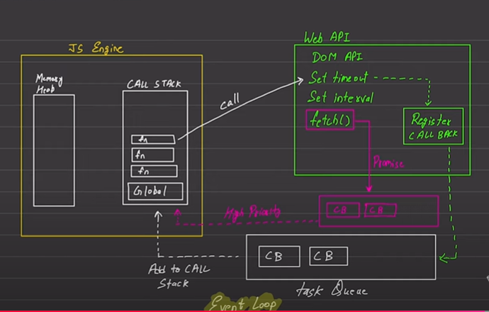

/**
 * Js is fundamentally synchronous is nature, means it can only perform task one by one and is single threaded in nature.
 * However this resembles is only in context of js engines.
 * 
 * Generally js now as days aren't used with its simply engines however either uses web api's/browser or run time env like node which 
 * gives it a feel of asynchronous like promises, fetch api's, callbacks, setTimeouts, setIntervals etc.
 * 
 * Lets understand how js becomes asynchronous, so if we uses web api's/browser
 * that have DOM api's, setTimeout, setIntervals etc. (can be seen in windows object)
 * 
 * Or uses node js env which doesn't have DOM api' and rest everything so how flows happens.
 * 
 * 
 * Once global execution context is created and function calls start getting executed, these
 * function calls are pushed to call stacks and formulate a functional execution context.
 * 
 * Say we have a function which has a setTime , setTime is asynchronous in nature, so such is pushed to webApi,
 * inside webApi there is a register callback which pushes this call to a taskQueue, once it is popped from the task queue , it is
 * again pushed back into the call stack of js global execution context and thus is performed. This pushing and management happens via
 * event loop.
 * 
 * In this way async calls are handled.
 * 
 * In case of fetch this function when passed to web api, and sent to register callback is sent to a different queue which is different
 * from task queue and is having higher priority while the rest process remains same.
 * 
 * Consider diagram
* 
 * 
 * 
 */