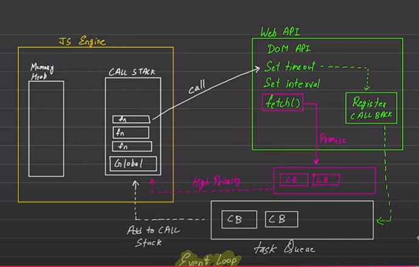

**Javascript**

**Background**

<!-- Previously javascript was compiled only by the 
browser as only browser was 
having the compiler which can understand 
java script and therefore js was predominantly known
 as client side scripting language.
Thus previously if we needed to run a js file we 
needed to add scripts in the 
index.html and then run the local host
and then the browser was able to understand the 
script.
  
However later on the compiler was been taken 
individually and is knows as node.js.
This helps in understanding of the js code 
without the need of the browser and 
thus the scope of js increased to
server side as well.
   
Dino.js is also one such compiler.
Thus in order to run standalone js files 
in our machine we need node.js
  
  
Js is dynamically typed language as we 
don't give types of any variable and 
is by default taken by
js and moreover its one variable assigned
to number can be again reassigned 
back to a string even. -->

<--------------------------------------------------------------------------------->

 **Hoisting**

<!-- Hoisting is a behavior where variable and 
function declarations are moved
 to the top of their scope during the compilation
phase,
before the code is executed. This means you can use
variables or call 
functions before they are declared in the code.
  
However different dataTypes have different 
properties like:
 
1. var type - its declaration is hoisted and not 
the value at top of the scope and its value is 
initialized with undefined
 
1. let type - its declaration is hoisted at top of the 
scope and are not initialized and accessing them before 
declaration result in reference error as they are
placed in temporal dead zone and are not accessible to 
compiler before its initialization in execution phase
  
2. const type - its declaration is hoisted at top 
of the scope and are not initialized and accessing them
before declaration result in reference error as they are
placed in temporal dead zone and are not accessible to 
compiler before its initialization in execution phase -->

<!-- console.log(hoistVar);  undefined and no 
reference error -->
var hoistVar = 10;

<!-- console.log(hoistLet); 
// reference error -->
let hoistLet = 10;

<!-- console.log(hoistConst); 
// reference error -->
const hoistConst = 10;

<!-- /**Functions are also hoisted before 
their declaration so we can call
a function even before its declared */ -->
greet();

function greet() {
    console.log("Hello, world!");
}

<!-- /**Data types when used as functional 
expressions are also treated as same based 
on hoisting rules for var, let and const */ -->

<!-- console.log(foo); // undefined  -->
var foo = function () {
    console.log("Hi!");
};

<!-- console.log(bar); 
// ReferenceError -->
let bar = function() {
  console.log("Hi!");
};

<!-- Lets understand why hoisting happens.
  
So there are two phases one is compilation and other 
is execution.
  
During compilation all variables are hoisted so for 
example say our code is:
  
            console.log(a);
            var a = 10;

            console.log(b);
            let b = 20;

            hello();
            function hello() {
            console.log("Hello, world!");
            }

Now compilation phase will happen and everything
will be hoisted

// During compilation phase:

    var a;           // Hoisted and initialized with 
                     undefined

    let b;           // Hoisted but uninitialized 
                     (in temporal dead zone)

    function hello() {
    console.log("Hello, world!");
    }

// During execution phase:
        console.log(a);  // undefined
        a = 10;

        console.log(b);  // ReferenceError 
                         (b is in Temporal dead zone)
        b = 20;

        hello();         // "Hello, world!"

   So to summarize, during compilation phase all the 
   functions and 
   variables declarations are hoisted.
   var and other functions are taken to top of scope
   let and const are taken to temporal dead zone.

   Now in case of var its hoisted by taken to top of
   scope and 
   initialized with value undefined,
   in case of let and const its hoisted by taken to 
   temporal 
   dead zone and not initialized.

   Now when console.log(a) comes , compiler sees it is 
   present 
   and it was hoisted with value undefined 
   so undefined gets printed.
   
   Now a gets set to 10.

   Now compiler see console.log(b), compiler can't 
   find it as its 
   hoisted and present in temporal dead zone and thus 
   reference error comes up -->

<---------------------------------------------------------------------------->

 **Var, let & Const**

<!-- 
 * 1. Scope difference:
 * 
 * var has a function/global scope where as let and const are having
 * block scope only.
 * 
 * So a is defined inside a block but still its having a block and 
 * global 
 * scope thus we can print a, 
 * however b and c are let and
 * const respectively and thus its having block scope only and are 
 * not 
 * accessible outside the block.
  -->

if (true) {
    var a = "10";
    let b = 1;
    const c = 2;
}

console.log(a);
console.log(b);
console.log(c);

<!-- /**
 * 2. Hoisting difference:
 * 
 * var, let and const all are hoisted however only var is hoisted and 
 * initialized with 
 * undefined where as let and const are hoisted in
 * temporal dead zone but not initialized and due to their presence 
 * in temporal dead zone 
 * after hoisting if we access them before its
 * declaration it gives a reference error.
 * 
 */ -->

console.log(p);
var p = 10;

console.log(q);
let q = 20;

console.log(r);
const r = 1;

 <!-- * 3. Re declaration
 * 
 * var can be re-declared in the same scope whereas 
 * let and const can not be re 
 * declared in the same scope -->
 

var name = "Gaurav";
var name = "Pankaj";   // allowed

let surname = "bhatt";
// let surname = "bhatt";   // not allowed

const z = 1;
// const z = 2; // not allowed

<!-- 
 * 4. Re Assignment
 * 
 * var and let can be re-assigned in the same scope 
 * whereas const 
 * can not be re assigned in the same scope -->

var school = "DDPS";
school = "Dps";   // allowed

let city = "Ghaziabad";
city = "Banglore";   // not allowed

const state = 1;
// state = 2; // not allowed

<------------------------------------------------------------------------------------------>

**Data types**

 <!-- * Java script has primitive as well as non primitives 
 data types:
 * 
 * Primitives: They are called by values
 * 
 * string
 * number
 * bigInit
 * boolean
 * undefined
 * symbol
 * null
 * 
 * 
 * Non primitives: They are called by reference
 * 
 * object
 * Array
 * functions 
 *  -->
 

let a = "Gaurav";
let b = 3;
let c = BigInt(10);
let d = true;
<!-- // e is declared but never initialized and thus its undefined as 
its value is not defined -->
let e; 
let f = null; // this means f is empty and has no value

let id1 = Symbol('123');
let id2 = Symbol('123');

<!-- // false as symbol is used to make things unique no 
matter even if  -->
console.log(id1 === id2) 
same values are being passed.

console.table([a, b, c, d]);
console.log(typeof undefined) // undefined
console.log(typeof null) // object

/**Its an object and typeOf obj is obj itself */
let obj = {
    name: "Gaurav",
    age: 23
}
console.log(typeof obj); // obj

let addFunc = function addNumberS(a, b) {
    return a + b;
}
console.log(typeof addFunc); // function

let arr = [1,2,3]; 

console.log(typeof arr) // obj

 <!-- * The main difference between null and undefined is 
 undefined means 
 * the value is not defined yet but its data type
 * is itself undefined
 * 
 * whereas null means void or nothing or empty and doesn't
 *  means its not defined.
 *  Its type is an object.
  -->

 <------------------------------------------------------------------------------------>

 **Type conversions**

 <!-- /**
 * Conversion to number type
 */ -->

let a = "0";
console.log(Number(a)); // 0

let b = true;
console.log(Number(b)); // 1

let c = "33abcd";
console.log(Number(c)); //Nan

let d = NaN;
console.log(Number(d)); // Nan

let e = null;
console.log(Number(e)); // 0

let f = undefined;
console.log(Number(f));  // Nan

<!-- /**
 * O/p:
 * 
 * /**
┌─────────┬────────┐
│ (index) │ Values │
├─────────┼────────┤
│ 0       │ 0      │
│ 1       │ 1      │
│ 2       │ NaN    │
│ 3       │ NaN    │
│ 4       │ 0      │
│ 5       │ NaN    │
└─────────┴────────┘
 */ -->

console.table([Number(0), Number(true), Number("33abc"), Number(NaN), Number(null), Number(undefined)]);

<!-- /**Operations 
 * 
 * If we are concat a string with number, the result will always be a string 
 * concat only, however
 * if two numbers are added before string concat , then numbers are added first
 * and then concatenated 
 * with string.
 * Ex: console.log(1+2+"3") will be 33
 * however
 * console.log("1"+2+3) will be 123
*/ -->

console.log("1" + "2") // 12
console.log("1" + 2) // 12
console.log(1 + "2") //12
console.log("1" + 2 + 3) // 123
console.log(1 + 2 + "3") // 33
<!-- // + operator, when used with a non-number operand, 
tries to convert it into a number so 1 -->
console.log(+true); 

<!-- /**Comparisons
 * 
 * In comparisons things are being converted to numbers and then 
 * checked upon, in case of ==
 * only values are compared in case of === values as well as data 
 * types are being compared.
 */ -->

<!-- //true because only values are compared -->
console.log(2 == "2");

<!-- //false as type and value both are compared -->
console.log(2 === "2"); 

<!-- // true as "2" is converted to a number and compared
 with number 1  -->
console.log("2" > 1) 

<!-- // null when converted to number is 0 and 2 when 
converted to number is 2  -->
console.log(null > "2");

so 0> 2 is false.

console.log(null == "2") // false

<------------------------------------------------------------------------------------------->

**Stack and heap memory**

<!-- /**
 * Just like other programming languages there are two kinds 
 * of memory in js as well 
 * i,e heap and stack memory.
 * 
 * All primitives are call by value or a copy of their value
 * is provided whereas 
 * all non primitives in js are call by 
 * reference.
 * 
 * Let's take an example to understand
 * 
 * let name = "Gaurav";
 * let name1 = name;
 * 
 * name1 = "bhatt";
 * 
 * console.log(name);
 * console.log(name1);
 * 
 * o/p is: "Gaurav"
 *          "bhatt"
 * 
 * Let's understand how flow happened.
 * 
 * So when we said let name so a name variable 
 * got declared inside 
 * stack memory and it is referencing 
 * to a memory address in heap
 * which contains a value "Gaurav"; say $100000
 * 
 * Now when we said let name1 so a name1 variable 
 * got declared inside 
 * stack memory and is referencing to a 
 * new memory address in
 * heap which contains a duplicated value from name 
 * "Gaurav". say $100001
 * 
 * Now when we changed name1 to bhatt so the name1 
 * in stack was referencing 
 * to $100001 and thus at that address
 * the value got changed
 * from "gaurav" to "bhatt" and the name variable value which
 * is present 
 * in $100000 remained intact.
 * 
 * This same happens with all primitives in js.
 * 
 * However in js , the non primitives like array, 
 * object and functions 
 * are passed by reference. Let's understand this.
 * 
 * let obj = {
 * name: "Gaurav",
 * email: "bhatt@yahoo"
 * }
 * 
 * let obj1 = obj;
 * obj1.name = "bhatt";
 * console.log(obj.name);
 * console.log(obj1.name);
 * 
 * o/p : bhatt
 *       bhatt
 * 
 * So when we said let obj so obj named variable 
 * got created in the 
 * stack which is referencing to a memory location 
 * in heap say $111111 which is   storing two of the
 * properties i,e name and email.
 * 
 * Now when we said let obj1 = obj so we created 
 * another variable 
 * obj1 inside stack and it is referencing to the same
 * memory location which obj is
 * referencing to i,e $111111
 * and thus any change by obj1 in any of the properties in directly 
 * changing the properties present in the same 
 * reference as that of obj.
 */ -->

<!-- /**
 * Pass by values for primitives
 */ -->

let name = "Gaurav";
let name1 = name;

name1 = "bhatt";

console.log(name);
console.log(name1);

<!-- /**
 * Pass by reference for non primitives 
 * */ -->

let obj = {
    name: "Gaurav",
    email: "bhatt@yahoo"
}

let obj1 = obj;
obj1.name = "bhatt";
console.log(obj.name);
console.log(obj1.name);

<------------------------------------------------------------------------------------------>

**Strings**

<!-- /**
 * The main difference between
 * let str = "Gaurav" and let str1 = new String("Gaurav") 
 * is that the first syntax creates 
 * a primitive string whereas the
 * second string creates a string object.
 * 
 * Lets understand it:
 * 
 *          let str = "Gaurav";
            let str1 = str;
            str1 = "Bhatt";

            console.log(str);
            console.log(str1);

    str variable is created in stack and has reference to a 
    memory location which is 
    storing the value 
    "Gaurav" and is a primitive string.
    We said str1 = str;

    Now str1 is given a copy of str, so str1 is created 
    in stack and now is 
    referencing to a new memory 
    address which is storing a copy
    of str i,e "Gaurav";

    Once we change str1 then str1's value which is 
    present in a 
    different memory address gets 
    updated and thus no effect no str.

    Lets understand string object:

            let str2 = new String("Gaurav1");
            let str3 = str2;

            str3 = "Testing";
            console.log(str2);
            console.log(str3);

    when we say str2 = new String so str2 gets created 
    in stack and now is 
    pointing towards a memory 
    address which holds a string object.
    when we say str3 = str2 now str3 variable gets created in 
    the stack and 
    is also referencing to 
    same memory location as that of str2.
    Objects are passed by reference.

    However now we did str3 = "Testing", i,e assigned it to a primitive 
    string and not changed 
    the property of the object which its referencing
    to and thus this is a case of reference reassignment thus now 
    str3 is pointing to a new memory address which holds
    a primitive string "Testing" thus str2 remains unchanged.

    Lets summarize:

    str2 Points to a String Object:

    str2 holds a reference to a String object (String { "Gaurav1" }).
    This object is stored in memory.
    str3 = str2; Shares the Reference:

    str3 now references the same object as str2. Both 
    point to the same memory location.
    str3 = "Testing"; Reassigns str3:

    When you write str3 = "Testing";, you are not modifying 
    the String object. Instead:
    str3 is reassigned to point to a new primitive string ("Testing").
    This breaks the reference link between str2 and str3.
    str2 Remains Unchanged:

    str2 still holds the reference to the original 
    String object in memory 
    because you never modified the object itself.
    You only changed what str3 points to.

 */ -->

let str = "Gaurav";
let str1 = str;
str1 = "Bhatt";

console.log(str); // "Gaurav"
console.log(str1); //"Bhatt"

let str2 = new String("Gaurav1");
let str3 = str2;

str3 = "Testing";
console.log(str2);
console.log(str3);

<!-- /**
 * Even methods which manipulates the string, 
 * doesn't go and effect 
 * the object as they give back a
 *  primitive string.
 * 
 * So str4 was an reference variable pointing to an 
 * string object in heap
 * str5 is also a reference variable pointing to the same
 * object as that of str4
 * 
 * str5 = str5.replaceAll('a','b')
 * replaced all a's with b's and is a primitive string 
 * and thus reference
 * reassignment happened 
 * and str4 remain intact.
 */ -->

let str4 = new String("Gaurav12");
let str5 = str4;

str5 = str5.replaceAll('a','b');

console.log(str4); // Object{'Gaurav'}
console.log(str5); // Gburbv12

<----------------------------------------------------------------------------------->

**Arrays**

// const _ = require('lodash');

<!-- /**
 * Arrays are objects in js.
 */ -->

<!-- 
/**
 * Here we are creating a reference to the same array in 
 * memory. 
 * This means arr2 and arr point to the exact same object, 
 * not separate copies.
 * Thus change in any property will lead to change in original 
 * object itself.
 */ -->

let arr = [1, 2, 3, 4, 5];
let arr2 = arr;
arr2[0] = 9;

console.log(arr); // [ 9, 2, 3, 4, 5 ]
console.log(arr2);  // [ 9, 2, 3, 4, 5 ]

<!-- /**
 * Shallow copy:
 * In shallow copying a copy of the original object is 
 * created however its 
 * nested properties are shared via reference and
 * any change in the nested property will change the 
 * original object.
 * 
 * So in below an array variable is created in stack 
 * and is referencing
 * to an object in heap.
 * when we do array1 = [...array] we are doing a shallow copy
 * so a new variable array1 is 
 * created which is referencing to a new
 * memory address and the object is shallow copied 
 * from original object however the nested 
 * properties are still referenced to the
 * same original object and thus any change in nested 
 * property will also mark a change in original object.
 * 
 * array1[5].name = "bhatt" will also change the name value in array 
 * variable also as we are changing nested property
 * 
 * array1[0] = 9 will only change the array1 and not array itself.
 *  
 * There are many ways of shallow copy like: [...origValue] or Array.from(origValue)
 */ -->

let array = [1, 2, 3, 4, 5, { "name": "gaurav" }];
let array1 = [...array]; // shallow copy

array1[5].name = "bhatt"
console.log(array);
console.log(array1);

const originalArray = [1, 2, { a: 3 }];
const shallowCopy = Array.from(originalArray); // shallow copy

<!-- /**Deep copy 
 * 
 * A deep copy creates an entirely copy that is completely independent
 * of the original. It copies all levels of the structure, including 
 * nested properties ensuring there is no shared references between the 
 * original and the copy.
 * 
 * Thus any change in the copied value will not affect the original
 * 
 * There are many ways to deep copy like:
 * JSON.parse(JSON.stringify(origArray)),
 * _.cloneDeep(),
 * structuredClone()
 * 
*/ -->

let orig = [1, 2, [3, 4], { name: "gaurav" }];
let deepCopy = JSON.parse(JSON.stringify(array)); // deep copy

deepCopy[2][0] = 9; // Modify nested array
deepCopy[3].name = "bhatt"; // Modify nested object

console.log(orig);    // [1, 2, [3, 4], { name: "gaurav" }]
console.log(deepCopy); // [1, 2, [9, 4], { name: "bhatt" }]

// let deepCopy1 = _.cloneDeep(orig); // deep copy
// deepCopy1[2][0] = 9;

console.log(orig);    // [1, 2, [3, 4], { name: "gaurav" }]
console.log(deepCopy); // [1, 2, [9, 4], { name: "gaurav" }]

let deepCopy3 = structuredClone(orig); // deep copy

<!-- /**
 * Slice vs splice
 * 
 * In slice and well as splice the last index does not get included ,
 * in case of slice the original array
 * does not get altered whereas in case of splice the original 
 * array gets altered.
 */ -->

let original = [1, 2, 3, 4, 5];
let sliced = original.slice(0, 3); // last index not included

console.log(`After slicing original does not change and remains  ${original} and sliced array is ${sliced}`);

let spliced = original.splice(0, 3); // last index not included
console.log(`After splicing original got changed to ${original} and spliced array is ${spliced}`);

<!-- /**Merge arrays 
 * 
 * Spread operator is used to merge arrays.
 * Spread means when we use spread on anything it 
 * scatters its individual values
*/ -->

let a1 = [1, 2, 3, 4, 5];
let a2 = [6, 7, 8, 9, 10];

console.log([...a1, ...a2]);

<!-- 
/**Flat
 * 
 * This is used to flat an nth depth array
 */ -->

let a3 = [1, 2, [3], [4, [5, [6]]], [7, 8, 9], 10];
console.log(a3.flat(Infinity));

<------------------------------------------------------------------------------------------->

**Js execution**

<!-- /**Entire end to end javascript execution explanation:*/ -->

let num1 = 2;
let num2 = 3;

function addNumbers(num1, num2) {
    return num1 + num2;
}

let res1 = addNumbers(num1, num2);
let res2 = addNumbers(3, 7);

<!-- /**

 * Javascript execution happens in javascript execution context 
 * which is composed of 
 * 
 * 1. Global execution context
 * 2. Functional execution context
 * 
 * Global execution context is different for js executed on browser 
 * (window object) and is different from execution in node (global object)
 * 
 * In each of these context there composed of two things:
 * 1. Memory Creation phase
 * 2. Execution phase
 * 
 * So first in memory creation phase for above code.
 * 
 *          num1 is hoisted to top of its scope assigned in memory and 
 *          send to temporal dead zone as its a let.
 *          They are not accessible until the code reaches 
 *          their declaration.
 * 
 *          same happens with num2.
 * 
 *          The function addNumbers is hoisted with its 
 *          definition
 *          
 *          res1 and res2 are hoisted and send into TDZ
 *          like num1 and num2.
 *          
 * 
 * Now comes the execution phase.
 *        
 *         num1 reaches its declaration and gets assigned 
 *         with value 2
 *         num2 reaches its declaration and gets assigned 
 *         with value 3
 * 
 *         function addNumber was already hoisted
 *         with its definition.
 * 
 *         res1 was called as return from function 
 *         addNumber thus now function addNumber
 *         needs to be executed
 *         and thus function addNumbers is pushed to 
 *         call stack.
 * 
 *         Now for addNumbers again two process happen 
 *         just like two process of memory
 *         creation and execution happened for 
 *         GEC or global execution context
 * 
 *         **in memory creation phase num1 and num2 
 *         which are function parameters gets 
 *         hoisted and the arguments passed to
 *         function gets assigned with value of num1 and num2.
 *        
 *         After than execution happens and sum 
 *         of num1 and num2 is returned.
 *         
 *         Once its complete for addNumbers its 
 *         execution context is destroyed and function is
 *         taken out from call stack and value it 
 *         returns gets assigned to res1.
 * 
 *         Now  res2 was called as return from 
 *         function addNumber thus now function 
 *         addNumber needs to be executed
 *         and thus function addNumbers is pushed to call stack.
 *         
 *         Now for addNumbers again two process happen 
 *         just like two process of memory 
 *         creation and execution happened for 
 *         GEC or global execution context
 *  
 *         Once its complete for addNumbers its execution context is 
 *         destroyed and function is
 *         taken out from call stack and value it returns 
 *         gets assigned to res2.
 * 
 */ -->

<!-- /**
 * Let's understand call stack concept in js with
 *  help of an example.
 */ -->

function one() {
    console.log(`Inside function one`);
}

function two() {
    console.log(`Inside function two`);
}

function three() {
    console.log(`Inside function three`);
}

one();
two();
three();

<!-- /**
 * So javascript executes line by line,
 * so first it came to one() and sees that 
 * its being called so one() came 
 * inside the function call stack and gets executed,
 * since execution of one() is completed so its being
 * removed from function call 
 * stack and then two() is inserted in call stack
 * after two() is completed then three() is 
 * pushed to call stack and then 
 * once executed is pushed out from call stack.
 * This call stack is known as functional call 
 * stacks and takes care of the 
 * function execution schedule.
 * 
 */ -->

<----------------------------------------------------------------------------------------------------------->

**If & else**

<!-- /**
 * The condition inside if is evaluated as either 
 * a true value or a false value.
 * However we can also evaluate truthy or falsy values.
 * 
 * There are some specific things which are
 * considered as falsy like
 * 
 * "", 0, -0, 0n, null, Nan, undefined, false
 * rest are considered as truthy value.
 */ -->

let userName = "g@bhatt"
if (userName) {
    console.log(`Username evaluated to truthy`);
}

<!-- /**Switch case */ -->

switch (userName) {
    case "g@bhatt":
        console.log(`Found Username : ${userName}`);
        break;
    case "panda@abc":
        console.log(`Found Username : ${userName}`);
        break;
    default:
        console.log("woooo");
}

<!-- /**
 * The nullish coalescing operator (??) 
 * 
 * It is a logical operator that provides a way to
 * assign a default value to a 
 * variable when the original value is null or undefined.
 */ -->

let val = null;
val = null ?? 10;
// console.log(val);

<!-- /**
 * Ternary operator
 */ -->

let val1 = 3 >= 3 ? 'yes' : 'false';

<------------------------------------------------------------------------------------------>

**Objects**

<!-- /**
 * An object in js is a dataType .
 * 
 * There are two ways to create an object i,e via 
 * 1. Object literal
 *  let obj = {};
 *  This is not a singleton objects i,e multiple instances
 *  of obj can be 
 *  created and shared across.
 * 
 * 2. Constructor Function
 *  let obj = new Object();
 *  This is a singleton object i,e this is the only single 
 *  instance of obj and
 *  only this single instance
 *  will be shared across all the other places if needed.
 */ -->

<!-- /**
 * 1.Object literal: 
 */ -->

let obj = {
    name: "Gaurav",
    age: 27,
    "full_name": "Gaurav Bhatt",
    email: "abc@pqrs.com",

}

// console.log(obj.name);
// console.log(obj["full_name"]);
// console.log(obj["email"]);

<!-- /**1.1
 * 
 * Insert a dynamic valued key in an object, 
 * 
 * this dynamic key property is accessed via obj[nickname] 
 * and not obj["nickName"]
 * whereas rest normal properties are accessed either as
 * obj["name"] or obj.name
 */ -->

let nickName = "PropertyName";
obj = {
    name: "Gaurav",
    age: 27,
    "full_name": "Gaurav Bhatt",
    email: "abc@pqrs.com",
    [nickName]: "booo"
}

// console.log(obj[nickName]);

<!-- /**1.2
 * 
 * Insert a dynamic key as a property which is having 
 * a dynamic value in an object
 *  */ -->

let propName = "prop_name";
let propValue = "prop_value";

obj = {
    name: "Gaurav",
    age: 27,
    "full_name": "Gaurav Bhatt",
    email: "abc@pqrs.com",
    [propName]: `${propValue}`
}

// console.log(obj[propName]);

<!-- /**1.3
 * 
 * Change value of a property in object
 *  */ -->

obj[propName] = 'prop_value_1'
// console.log(obj);

<!-- /**1.4
 * 
 * Don't allow any change in value for any property 
 * in object
 *  */ -->

Object.freeze(obj);
obj[propName] = 'prop_value_2';
// console.log(obj);

<!-- /**
 * 1.5
 * 
 * Don't allow change only for email property 
 * in object
 *
 */ -->
  
propName = "prop_name";
propValue = "prop_value";

let obj1 = {
    name: "Gaurav",
    age: 27,
    "full_name": "Gaurav Bhatt",
    email: "abc@pqrs.com",
    [propName]: `${propValue}`
}

Object.defineProperty(obj1, "email", {
    writable: false, // prevents the property from being modified

    configurable: false // prevents the property from being 
                        deleted or reconfigured
});

obj["email"] = "change@change.com";
// console.log(obj1);

<!-- /**
 * 1.6
 * 
 * Insert a function in value of a key in object
 */ -->

obj1 = {
    name: "Gaurav",
    age: 27,
    "full_name": "Gaurav Bhatt",
    email: "abc@pqrs.com",
    [propName]: `${propValue}`,
    greet: function () { console.log(`Send greetings from ${this.name}`) }
}

// obj1.greet();

<!-- /**
 * 1.7
 * 
 * Create and access a nested object
 */ -->

let obj3 = {
    email: "xyz@gmail.com",
    details: {
        fullName: {
            firstName: "gaurav",
            lastName: "bhatt"
        },
        address: {
            pinCode: 201002,
            city: "ghaziabad"
        }
    }
}

// console.log(obj3["details"]["address"]["pinCode"]);

<!-- /**
 * 1.8
 * 
 * Combine n number of objects together
 */ -->

let obj4 = { 1: "0", 2: "1" };
let obj5 = { 3: "2", 4: "3" };

// console.log({ ...obj4, ...obj5 });

<!-- /**
 * 1.9
 * 
 * Give me all the keys and all the values
 * of a object
 */ -->

let obj6 = {
    name: "Gaurav",
    age: 27,
    "full_name": "Gaurav Bhatt",
    email: "abc@pqrs.com",
    [propName]: `${propValue}`
}

// console.log(Object.keys(obj6)); // gives an array of keys 
                                   of object

// console.log(Object.values(obj6)); // gives an array of values
                                      of object

// console.log(Object.entries(obj6)) // gives an array of array of
                                      key and values

<!-- // In case of nested objects it don't destructure 
the object entirely and give in 
accordance to the first or top level -->

obj3 = {
    email: "xyz@gmail.com",
    details: {
        fullName: {
            firstName: "gaurav",
            lastName: "bhatt"
        },
        address: {
            pinCode: 201002,
            city: "ghaziabad"
        }
    }
}

const keys = Object.keys(obj3);
const values = Object.values(obj3);

// console.log(keys); // [ 'email', 'details' ]

// console.log(values);
/**[
   'xyz@gmail.com',
   {
     fullName: { firstName: 'gaurav', lastName: 'bhatt' },
     address: { pinCode: 201002, city: 'ghaziabad' }
   }
 ]*/

<!-- /**
 * 1.10
 * 
 * Check if a property exists in an object
 */ -->

obj3 = {
    email: "xyz@gmail.com",
    details: {
        fullName: {
            firstName: "gaurav",
            lastName: "bhatt"
        },
        address: {
            pinCode: 201002,
            city: "ghaziabad"
        }
    }
}

// console.log(obj3.hasOwnProperty("email"));

<!-- /**
 * 
 * 1.11
 * 
 * Destructure an object
 */ -->

obj3 = {
    email: "xyz@gmail.com",
    details: {
        fullName: {
            firstName: "gaurav",
            lastName: "bhatt"
        },
        address: {
            pinCode: 201002,
            city: "ghaziabad"
        }
    }
}

let { email, details } = obj3;
let { fullName, address } = details;
// console.log(details);
// console.log(email);
// console.log(fullName);
// console.log(address);

<!-- /**
 * Property descriptor and making a property non 
 * writable in js
 */ -->

let object = {
    name: "Gaurav",
    phoneNumber: 9354337987,
    email: "bhatt@xcy.com"
}

console.log(Object.getOwnPropertyDescriptor(object, 'name'));
<!-- /**
 * We got o/p as 
 * {
  value: 'Gaurav',  
  writable: true,   
  enumerable: true, 
  configurable: true
}

so every property inside an object also has few 
properties like

writable: true,   
  enumerable: true, 
  configurable: true

  so we can alter these properties.
  writable means that this property of the object can be edited
  enumerable means that this object property is iterable 
  and by making it false 
  it wont get detected if we iterate over the object
  if we want to edit any property we can do.
 */ -->

for (let [key, value] of Object.entries(object)) {
    console.log(`${key}: ${value}`);
}

Object.defineProperty(object, 'phoneNumber', {
    writable: false,
    enumerable: false
})

object.phoneNumber = 99999999;
console.log(object);
for (let [key, value] of Object.entries(object)) {
    console.log(`${key}: ${value}`);
}

<--------------------------------------------------------------------------------->

**Object practices problems**

<!-- /**
 * Given an object, give me all the keys and values of 
 * this object
 * 
 */ -->

const obj = {
    name: "Alice",
    age: 30,
    salary: 50000
}

for (let [key, value] of Object.entries(obj)) {
    console.log(`${key}: ${value}`);
}

<!-- /**
 * 
 * Given an array of objects simple, find the total 
 * salary in this
 */ -->

const employees = [
    { name: "Alice", age: 30, salary: 50000 },
    { name: "Bob", age: 25, salary: 60000 },
    { name: "Charlie", age: 35, salary: 70000 }
];

function getTotalSalary(employees) {
    let sm = 0;
    for (let item of employees) {
        if (item.hasOwnProperty("salary")) {
            sm += item["salary"];
        }
    }
    return sm;
}

// console.log(getTotalSalary(employees));

<!-- /**
 * 
 * Given an array of objects complex, find the 
 * total salary in this
 */ -->

const employeeDetails = [
    {
        name: "Alice",
        age: 30,
        carrer: [
            {
                salary: 1,
                position: "SDE",
                dept: "IT"
            },
            {
                salary: 1,
                position: "SDE",
                dept: "IT"
            },
            {
                salary: 1,
                position: "SDE",
                dept: "IT"
            }
        ]

    },
    {
        name: "Bob",
        age: 25,
        carrer: [
            {
                salary: 1,
                position: "SDE",
                dept: "IT"
            },
            {
                salary: 1,
                position: "SDE",
                dept: "IT"
            },
            {
                salary: 1,
                position: "SDE",
                dept: "IT"
            }
        ]
    },
    {
        name: "Charlie",
        age: 35,
        carrer: [
            {
                salary: 1,
                position: "SDE",
                dept: "IT"
            },
            {
                salary: 1,
                position: "SDE",
                dept: "IT"
            },
            {
                salary: 1,
                position: "SDE",
                dept: "IT"
            }
        ]
    }
];

function getSalary(empDetails) {
    let sm = 0;
    for (let empDetail of empDetails) {
        if (empDetail.hasOwnProperty("carrer")) {
            for (let carrerDetails of empDetail["carrer"]) {
                if (carrerDetails.hasOwnProperty("salary")) {
                    sm += carrerDetails["salary"];
                }
            }
        }
    }
    return sm;
}

// console.log(getSalary(employeeDetails));

<!-- /**
 * Given an infinite object, the task is which 
 * ends with a key false, the task is 
 * to print a counter which
 * resembles the number of nested objects inside it
 */ -->

const nestedObject = {
    boolean: true,
    next: {
        boolean: true,
        next: {
            boolean: true,
            next: {
                boolean: true,
                next: {
                    boolean: true,
                    next: {
                        boolean: true,
                        next: {
                            boolean: true,
                            next: {
                                boolean: true,
                                next: {
                                    boolean: true,
                                    next: {
                                        boolean: true,
                                        next: {
                                            boolean: false,
                                            next: null
                                        }
                                    }
                                }
                            }
                        }
                    }
                }
            }
        }
    }
};

function countNestedObj(object) {
    let bool = false;
    let cnt = 0;
    if (object.hasOwnProperty("boolean")) {
        bool = object["boolean"];
    }
    let { boolean, next } = object;
    while (bool) {
        if (!boolean) {
            break;
        } else {
            boolean = next["boolean"];
            next = next["next"];
            cnt++;
        }
    }
    return cnt;
}

// console.log(countNestedObj(nestedObject));

<!-- /**
 * Given an array and a chunk size , the task is to 
 * segregate the array elements
 * based on chunks and return an array of
 * array of these chunks
 * 
 * Ex: arr = [1,2,3,4,5], chunkSize = 3
 * o/p: [[1,2,3],[4,5]] 
 */ -->

var chunk = function (arr, size) {
    let res = [];
    let i = 0;
    while (i < arr.length) {
        let chunk = arr.slice(i, size + i);
        res.push(chunk);
        i = size + i;
    }
    console.log(res);
};

// console.log(chunk([1, 2, 3, 4, 5], 3));

<!-- /**
 * Flatten n densely deep array
 * 
 * Ex: arr = [1, 2, 3, [4, 5, 6], [7, 8, [9, 10, 11], 12], [13, 14, 15]], n = 0
 * [1, 2, 3, [4, 5, 6], [7, 8, [9, 10, 11], 12], [13, 14, 15]]
 * 
 * Ex: arr = [1, 2, 3, [4, 5, 6], [7, 8, [9, 10, 11], 12], [13, 14, 15]]
   n = 1

   o/p: [1, 2, 3, 4, 5, 6, 7, 8, [9, 10, 11], 12, 13, 14, 15]

   Ex: arr = [[1, 2, 3], [4, 5, 6], [7, 8, [9, 10, 11], 12], [13, 14, 15]]
   n = 2

   [1, 2, 3, 4, 5, 6, 7, 8, 9, 10, 11, 12, 13, 14, 15]
 */ -->

function flatten(arr, n, currentDepth = 0) {
    if (n === 0 || currentDepth >= n) {
        return arr;
    }
    let res = [];
    for (let val of arr) {
        if (Array.isArray(val)) {
            res.push(...flatten(val, n, currentDepth + 1));
        } else {
            res.push(val);
        }
    }
    return res;
}

function flatten1(arr, n) {
    return arr.flat(n);
}

<!-- /**
 * Given two arrays arr1 and arr2, return a new array joinedArray. 
 * All the objects in each of the two inputs arrays will 
 * contain an id 
 * field that has an integer value. 
 * joinedArray is an array formed by merging arr1 and arr2 based on 
 * their id key. 
 * The length of joinedArray 
 * should be the length of unique values of id. The returned array 
 * should be sorted 
 * in ascending order based 
 * on the id key.
 * If a given id exists in one array but not the other, 
 * the single object with that 
 * id should be included
 * in the result array without modification.
 * If two objects share an id, their properties should be merged
 * into a single object:
 * If a key only exists in one object, that single key-value pair
 * should be included in the object.
 * If a key is included in both objects, the value in the object 
 * from arr2 should override 
 * the value from arr1.
 * 
 * Example 1:
 * Input:
 * arr1 = [
    {"id": 1, "x": 1},
    {"id": 2, "x": 9}
    ], 
    arr2 = [
    {"id": 3, "x": 5}
    ]

    Output: 

    [
    {"id": 1, "x": 1},
    {"id": 2, "x": 9},
    {"id": 3, "x": 5}

    ]

    Explanation: There are no duplicate ids so arr1 is 
    simply concatenated with arr2.

    Example 2:

    Input: 

    arr1 = [
    {"id": 1, "x": 2, "y": 3},
    {"id": 2, "x": 3, "y": 6}

    ], 

    arr2 = [
    {"id": 2, "x": 10, "y": 20},
    {"id": 3, "x": 0, "y": 0}

    ]

    Output: 

    [
    {"id": 1, "x": 2, "y": 3},
    {"id": 2, "x": 10, "y": 20},
    {"id": 3, "x": 0, "y": 0}

    ]

    Explanation: The two objects with id=1 and id=3 are 
    included in the result array without modification. 
    The two objects with id=2 are merged together. The 
    keys from arr2 override the values in arr1.

    Example 3:

    Input: 

    arr1 = [
    {"id": 1, "b": {"b": 94},"v": [4, 3], "y": 48}

    ]

    arr2 = [
    {"id": 1, "b": {"c": 84}, "v": [1, 3]}

    ]

    Output: [
    {"id": 1, "b": {"c": 84}, "v": [1, 3], "y": 48}

    ]

    Explanation: The two objects with id=1 are merged together.
    For the keys "b" and "v" 
    the values from arr2 are used. 
    Since the key "y" only exists in arr1, 
    that value is taken form arr1.
 
 */ -->

function mergeObjects(arr1, arr2) {
    let mp = new Map();
    for (let item1 of arr1) {
        mp.set(item1.id, item1);
    }
    for (let item2 of arr2) {
        if (mp.has(item2.id)) {
            let obj = mp.get(item2.id);
            let mergedObj = { ...obj, ...item2 };
            mp.set(item2.id, mergedObj);
        } else {
            mp.set(item2.id, item2);
        }
    }
    mp = new Map([...mp.entries()].sort((a, b) => a[0] - b[0]));
    let res = [];
    for (const [key, value] of mp) {
        res.push(value);
    }
    return res;
};

<---------------------------------------------------------------------------------->

**Functions**

<!-- /**
 * Pass n number of arguments to a function and
 * return the sum of all of them.
 * 
 * This can be done with the help of rest operators.
 */ -->

function addNumbers(...nums) {
    let sm = 0;
    for (let val of nums) {
        sm += val;
    }
    return sm;
}

// console.log(addNumbers(1, 2, 3, 4, 5));

<!-- /**
 * Treating functions like variables
 */ -->

let addMultiNumbers = function (...nums) {
    let sm = 0;
    for (let val of nums) {
        sm += val;
    }
    return sm;
}

// console.log(addMultiNumbers(1, 2, 3, 4, 5));

<!-- /**
 * Difference between normal function function declaration and
 * using variable to hold the function is 
 * 
 * 1. Syntax is different
 * 2. Normal function undergoes hoisting i,e if i say 
 * 
 * addNumbers(1,2,3);
 * function addNumbers(...nums) {
    let sm = 0;
    for (let val of nums) {
        sm += val;
    }
    return sm;
    }
    Clearly we have called the function first and then declared it, 
    since function are hoisted 
    and thus there was no issue.
    Hoisting means taking the declaration to top of the their scope.

    Variable associated function works based upon the scope of 
    hoisting of the variable 
    type used ex: var, let or const.
    See different cases for better understanding.
 */ -->

<!-- /**
 * Case1:
 */ -->

// console.log(normal(2, 3)); // no problem
function normal(a, b) {
    return a + b;
}

<!-- /**
 * Case2:
 * This will have error fun is not defined because after
 * hoisting the code will look like
 * var fun;
 * console.log(fun(2,3))
 * fun = function (a, b) { 
    return a + b; 
   }; 
    Clearly error is thrown in line 2 console.log(undefined(2,3));
 */ -->

// console.log(fun(2, 3)); 
var fun = function (a, b) {
    return a + b;
}

<!-- /**
 * Case3:
 * Using let and const
 * Let and const are also hoisted just like var however 
 * they remain in Temporal dead zone and are not initialized
 * till its declaration is encountered in code.
 * So when code comes to console.log(fun1), fun1 was present 
 * in temporal dead zone and was not 
 * initialized and thus error will be 
 * thrown that can't access fun1 before initialization. 
 */ -->

// console.log(fun1(2, 3, 4));
let fun1 = function (...num) {
    return num
}

<!-- /**
 * Closures:
 * In cases of having function inside a function,
 * the inner function will have access to the variables of 
 * outer function as for 
 * inner function these variables of
 * outer function has global scope but the outer function can
 * not have access to variables 
 * of inner function as
 * the inner function variables has block scope.
 */ -->

function one() {
    let variableOne = "outerVariable";
    function two() {
        let variableTwo = "innerVariable";
        console.log(variableOne);
    }
    two();
    console.log(variableTwo); // problematic as this is inner variable and has 
                              only block scope within function two.
}

// one();

<!-- /**
 * Function inside an object and this keyword
 * 
 * function which is used as value to property 
 * welcome of obj is an anonymous 
 * function as its without any name.
 * 
 * In obj the context is having property like name, email.
 * this keyword refers to the current instance of obj 
 * or the current context of obj.
 */ -->

let obj = {
    name: "Gaurav",
    email: "xyz@abc.com",
    welcome: function () { // its an anonymous function i,e without any name
        return `Hello ${this.name}`;
    }
}

// console.log(obj.welcome());

<!-- /**
 * This keyword in browser vs this keyword in node env
 * 
 * console.log(this) gives the current context.
 * 
 * In browser the current context or the current instance is the window so 
 * window object is shown where as in node env
 * the current context or current instance in an empty object. 
 */ -->

// console.log(this);

function thisTesting() {
    const userName = "gaurav";
    console.log(this); // gives a lot of global object prop associated 
                       with function but does not 
                       include any kind of variables associated with function

    console.log(this.userName); // undefined as we can only get props of 
                                objects through this and not of functions.
}

// thisTesting();

<!-- /**
 * Arrow functions
 */ -->

let arrow = () => {
    let name = "gaurav";
    console.log(this.name); // undefined same concept as that of a 
                            normal function

    return `we are using arrow function`;
}

<!-- /**
 * Case: Implicit return arrow function
 * 
 * if we only have one liner logic then we can use
*  () and avoid return statement
 * however if we use {} then a return statement is must.
 */ -->

let arrow1 = (num1, num2) => (num1 + num2);

<!-- /**
 * IIFE (Immediately invoked function executions)
 * 
 * IIFE are self executed functions and 
 * since variables declared inside the 
 * scope of the function (let & const),
 * will have scope within it so IIFE are used to 
 * avoid global variables pollutions, 
 * and used in scenarios where
 * the function need to be invoked immediately.
 */ -->

(function IIFE() { // named IIFE
    console.log(`IIFE syntax as normal function`);
})();

/**IIFE syntax as arrow function */

(() => {
    console.log(`IIFE syntax for arrow function`)
})();

/**IIFE syntax for implicit return arrow function */

(() => (console.log(`IIFE syntax for implicit returned arrow function`)))();

/**IIFE syntax with function parameters */

((name) => {
    console.log(`Hello my name is ${name}`);
})("Gaurav");

<!-- /**
 * Callback functions:
 * 
 * A callback function is a function that is passed 
 * as an argument to another function 
 * and is intended to be executed later or immediately, 
 * either synchronously or asynchronously.
 * 
 */ -->

<!-- /**
 * Here the arrow function passed inside as an 
 * argument to forEach is a callback function. 
 */ -->

let arr = [1, 2, 3, 4, 5];
arr.forEach((val) => {
    console.log(val);
})

function print(val) {
    console.log(val);
}

// arr.forEach(print); // passed reference of a 
                       callback function print inside for each

<!-- /**
 * Here the callback function of print which is passed
 * as an argument to forEach 
 * function is executed immediately
 * in a synchronous way, that is code is getting executed
 * for print and don't 
 * have to wait to print to get completed.
 * 
 * We can also take an example of asynchronous callback.
 * 
 * So returnResp takes a callback function which it 
 * calls back once it 
 * completes its execution.
 * so we call returnResp with callback function (the function which 
 * returnResp needs to callBack) 
 * once its completes
 * execution and is getResponse.
 * 
 * So once in 2 secs returnResp complete execution, it call 
 * back to getResponse and thus the o/p is
 * 
 * Call callback function after 2 secs
 * Call back function called successfully
 */ -->

function returnResp(callback) {
    setTimeout(() => {
        console.log("Call callback function after 2 secs");
        callback();
    }, 200)
}

function getResponse() {
    console.log("Call back function called successfully");
}

returnResp(getResponse);

let obj1 = [
    {
        language: "JS",
        description: "Javascript"

    },
    {
        language: "Java",
        description: "Java"

    },
    {
        language: "python",
        description: "py"

    }
]

for (let val of obj1) {
    console.log(`${val.language} has description ${val.description}`);
}

<------------------------------------------------------------------------------------------------>

**Loops**

<!-- /**
 * 
 * Break statement is used to break and terminate the loop, 
 * whereas continue statement is used to
 * skip that particular iteration and jump to next iteration.  
 */ -->

for (let i = 0; i < 20; i++) {
    if (i === 5) {
        continue
    }
    if (i === 10) {
        break;
    }
    // console.log(i);
}

<!-- /**
 * while loop
 */ -->

let i = 0;
while (i <= 10) {
    // console.log(i);
    i++;
}

<!-- /**
 * Do while loop
 */ -->

let j = 11;
do {
    // console.log(j);
    j++;
} while (j <= 10);

<!-- /**For of loops */ -->

let arr = [1, 2, 3, 4, 5]

for (let val of arr) {
    // console.log(val);
}

let obj = {
    name: "Gaurav",
    age: 27,
    number: 9354377832
}

// for (let key of obj) { // objects are not iterable and can't be 
                          looped in using for of loop
//     // console.log(obj[key]);
// }

let mp = new Map();
mp.set(1, "India");
mp.set(2, "US");

for (const [key, value] of mp) {
    // console.log(key + '-> ' + value);
}

<!-- /**
 * 
 * For in loop
 */ -->

obj = {
    name: "Gaurav",
    age: 27,
    number: 9354377832
}

for (let keys in obj) {
    // console.log(keys + '-> ' + obj[keys]);
}

arr = [1, 2, 3, 4, 5];
for (let i in arr) {
    // console.log(arr[i]);
}

// for(let key in mp){  // it wont work as map is an iterable object and 
                        needs for of.
//     console.log('abc');
//     console.log(key);
// }

<!-- /**
 * The main difference between for in loop and for of loop is that,
 * for of loop gives values directly, whereas for in loop gives the keys of 
 * which we are iterating.
 * 
 * for of loop is specifically designed to iterate over the values 
 * of iterable objects.
 * for in loop is designed to iterate over the enumerable properties
 * of an object, 
 * 
 * For ex: for of loop failed in object because keys in 
 * object are random arbitrary 
 * user given and thus to get
 * value of an object it needs keys but keys are also not 
 * available whereas in for in loop,
 * we have access to keys
 * so we can iterate using keys in obj and then use these 
 * keys to get obj.
 * 
 * For of passes in array as it can get hold of values,
 * for in loop also passes in array as array is also an 
 * object with non arbitrary index 
 * and specif index i,e 0,1,2,3,4....
 * so a for in loop will give index in array which can be
 * used to get value.
 */ -->

 <-------------------------------------------------------------------------------->

 **Filter map & reduce**

 <!-- /**
 * For each loop;
 * 
 * For each loop is used to loop over the items and take a call back 
 * function which is capable
 * of handling three parameters i,e val,index and arr.
 * 
 * Val is arbitrary name for the inputs, index can be considered as index 
 * values and arr is the array itself.
 * For each loop does not return anything and its return type is void.
 */ -->

let arr = [1, 2, 3, 4, 5];
arr.forEach((val, index, arr) => {
    // console.log(val, index, arr);
})

<!-- /**Filters
 * 
 * Filter function in array is used to filter out some elements 
 * based upon a certain
 * condition and it also takes a callback function as argument 
 * and returns a number [];
 */ -->

let res = arr.filter((val) => {
    return val > 2;
})

// console.log(res);

let obj = [
    {
        name: "Gaurav",
        role: "SDE1"
    },
    {
        name: "Poonam",
        role: "SDE1"
    },
    {
        name: "Brijesh",
        role: "SDE2"
    },
    {
        name: "Pankaj",
        role: "SDE2"
    },
    {
        name: "Vinod",
        role: "SDE2"
    }
]

let res1 = obj.filter((item) => {
    return item.role === "SDE2";
})

// console.log(res1);

<!-- /**
 * Map function in array is used to transform elements in the array.
 * It takes an callback function as an argument parameter 
 * and also returns a nums []
 */ -->

let res2 = arr.map((item) => {
    return item * 2;
})

// console.log(res2);

<!-- /**
 * Chaining of methods
 */ -->

let res3 = arr.map((val) => {
    return val * 10;
}).map((val) => {
    return val + 1;
}).filter((val) => {
    return val % 11 === 0;
})

// console.log(res3);

<!-- /**Reduce methods 
 * 
 * Find sum of elements in array
 * 
 * Reduce methods takes a callback as an function argument ,
 * this call back function needs
 * a prevValue which is a number and a currentValue which 
 * is the current iterated value
 * 
 * So in our case of finding sum of elements of array, we used 
 * prevValue as 0 and the currentValue will be 
 * iteration over every element of the array.
 * 
 * we return prevValue + currentValue thus after every iteration 
 * the prevValue keeps on updating itself 
 * as prevValue + currentValue
*/ -->

let initial = 0;
let res4 = arr.reduce((prevValue, currentValue) => {
    return prevValue + currentValue;
}, initial)

// console.log(res4);

<!-- /**
 * Add all prices in shopping cart using reduce
 * 
 * so we have two parameters in callback function argument 
 * of reduce which are prev and current,
 * prev is the previously obtained value which is number and 
 * current is the current iteration.
 * 
 * So we return prev + current["price"] where initial value 
 * of prev we set to 0.
 */ -->

let cart = [
    {
        course: "js",
        price: 100
    },
    {
        course: "DSA",
        price: 200
    },
    {
        course: "ts",
        price: 300
    },
]

let sum = cart.reduce((prev, current) => {
    return prev + current["price"];
}, 0);

console.log(sum);

<----------------------------------------------------------------------------------->

**DOM (Document object model)**

<!--
Lets understand DOM, its called as document object model. 
An html is composed of objects 
of a document and thus collectively
they are document object model.

Lets see a DOM diagram for the below code.

                                               Window
                                                 |
                                              Document
                                                 |
                                                HTML
                                     |                        |
                                    Head                    Body
                                |          |             |        
                              Meta        Title         Div
                                                         |
                                                         P

    So we can manipulate DOM according to our needs and this concept
    is simply DOM manipulation. 
-->

<!DOCTYPE html>
<html lang="en">

<head>
    <meta charset="UTF-8">
    <title>Document</title>
</head>

<body>
    

        <h1>E-Commerce</h1>
        
This is a shopping paradise

    

</body>

</html>

<---------------------------------------------------------------------------------->

**DOM manipulation**

                                    <!--HTML>

<!DOCTYPE html>
<html lang="en">

<head>
    <meta charset="UTF-8">
    <title>Document</title>
    <!--Kind of a custom css/scss file content -->
    

<body class="bg-class">
    

        <h1 id="title" class="header">E-Commerce</h1>
        
This is a shopping paradise
            for women
        

        <h2 id="sub-header1">Lorem.</h2>
        <h2 id="sub-header2">Lorem ipsum</h2>
        <h2 id="sub-header3" class="header3">Lorem, ipsum dolor.</h2>
        <ul>
            <li class="list-item">Checker1</li>
            <li class="list-item">Checker2</li>
            <li class="list-item">Checker3</li>
        </ul>
        

            
Monday

            
Tuesday

            
Wednesday

            
Thursday

            
Friday

            
Saturday

            
Sunday

        

        <ul class="languageList">
            <li class="language1">js</li>
        </ul>
    

    <!--Script or js file is added here-->
    
</body>

</html>

               
                                        <!--SCRIPT>
                                    
<!-- /**Used to get the element by the id and get 
stored in title variable */ -->
const title = document.getElementById('title');

<!-- /**Used to get the element by class name and returns
a html collection */ -->
let item = document.getElementsByClassName('list-item');

//converting html collection into an array
let itemArray = [...item];
itemArray.forEach((li) => {
    li.style["font-size"] = "20px";
})

<!-- /**Used to get the attribute class value of an element 
which we are fetching via id */ -->
console.log(document.getElementById('title').getAttribute('class'));

<!-- /**Used to set attribute class over an element 
   which we got by id. Here two 
   classes we have set i,e para1 p1.
 * If only one class would have been set then it would have over
 *  ridded the existing class.
*/ -->
document.getElementById('description').setAttribute('class', 'para1 p1');

<!-- /**Used to set styling on element stored 
in title variable. */ -->
title.style.background = "green";
title.style.borderRadius = "5px";
title.style.padding = "5px";

<!-- /** Difference between innerText and textContent,
 * 
 * suppose in html "description" is the id 
 * of a p tag which is having some text 
 * and inside there is also a span which is 
 * having some more text.
 * Now in the span we have given an style of 
 * display none, so this addition more 
 * text inside span will not be
 * visible.
 * 
 * So if we do document.getElementById("description").
 * innerText so it will give 
 * only the text which will be visible after
 * the styles have been applied.
 * 
 * however  document.getElementById("description").
 * textContent will even show the 
 * text within the span which will not be shown
 * on browser due to styling.
*/ -->

const description = document.getElementById("description");

console.log(description.innerText);
console.log(description.textContent);

<!-- /**Used to get the innerHtml */ -->
console.log(description.innerHTML);

<!-- /**Query selector is used to get elements 
    based on id or class or
   even direct tag names.
 * In case of presence of multiple elements it will 
 * give you the first by default
 */ -->

<!-- //selecting query by tag name directly -->
console.log(document.querySelector('h2'));

<!-- //selecting query by id  -->
console.log(document.querySelector('#sub-header2'));

<!-- //selecting query by class name -->
console.log(document.querySelector(".header3"));

let ul = document.querySelector('ul');
let li = ul.querySelector('li');
li.style.color = "red";

<!-- /**Query selector all is used to give a nodeList of 
   all the elements which are 
   getting matched based
 * upon id, class or even the tag name itself.
 * 
 * Node list may somewhat looks similar to array but 
 * however its not as it does 
 * not include some basic array
 * operations like map, filter , reduce etc and thus 
 * its different
 */ -->

let myLi = document.querySelectorAll('li');
myLi[0].style.color = "red";
myLi[1].style.color = "green";
myLi[2].style.color = "blue";

myLi.forEach((item) => {
    item.style.backgroundColor = 'white';
})

//conversion of node list to array
myLiArray = [...myLi];
console.log(myLiArray);

<!-- /**Accessing DOM elements using 
relationships */ -->

let parentObj = document.querySelector('.parent');

<!-- //gives html collection from parentObj -->
let childHtmlCollection = parentObj.children;

<!-- //iterating over html collection 
using for of loop -->
for (let item of childHtmlCollection) {
    item.style.color = "orange";
    item.style.padding = "2px";
}

<!-- //getting the first child from an parentObj -->
let firstChild = parentObj.firstElementChild;
let lastChild = parentObj.lastElementChild;

<!-- //reaching the parent from children -->
parentObj = firstChild.parentElement;

<!-- //reaching siblings from children -->
let sibling = firstChild.nextElementSibling;

<!-- /**
 * Child nodes are nodes which are present inside an element for ex: 
 * if we see 
 * parent class in html then we can say
 * classes like child1, child2 .... etc are its child nodes, 
 * however enters, comments etc
 * are also taken into consideration
 * while considering child nodes.
 */ -->

let mainNode = document.querySelector(".parent");
console.log(mainNode.childNodes);

<!-- /**Creating a element in document */ -->

<!-- // creating a new div and giving it some id, class 
name some styling and some  -->
text and then appending it to document.

let div = document.createElement("div");
div.className = "customDiv";
div.id = Math.round(Math.random() * 10 + 1);
div.style.backgroundColor = "blue";
div.style.color = "black";
let textNode = document.createTextNode("This is a custom div via script")
div.appendChild(textNode);

document.body.appendChild(div);

<!-- // appending more li into a ul via a function which 
takes langName as parameter and use 
that as text in li. -->

document.querySelector(".language1").style.background = "#212121"

function createListElements(languageName) {
    let ulLanguageList = document.querySelector(".languageList");
    let li = document.createElement('li');
    let textNode = document.createTextNode(languageName);
    li.appendChild(textNode);
    ulLanguageList.appendChild(li);
}

createListElements("java");
createListElements("typescript");
createListElements("python");

<!-- /**Editing an existing element in document */ -->

<!-- //editing an existing list item in ul via creating a new li
 and then replacing the old with new. -->
let individualLang = document.querySelector('.languageList :nth-child(2)');
let newLi = document.createElement('li');
newLi.appendChild(document.createTextNode("maje lo"));
individualLang.replaceWith(newLi);

<!-- // editing an list item by directly changing the 
outerHTML of it. -->
let firstChildList = document.querySelector('.languageList :first-child');
firstChildList.outerHTML = '<li>changed and edited item</li>'

<!-- /**Deleting an existing element in document */ -->
let lastChildList = document.querySelector('.languageList :last-child');
lastChildList.remove();

<---------------------------------------------------------------------------------------->

**Events**

                                      <!--HTML>

<!DOCTYPE html>
<html lang="en">

<head>
    <meta charset="UTF-8">
    <meta name="viewport" content="width=device-width, initial-scale=1.0">
    <title>Document</title>
</head>

<body>
    <ul id="cityList">
    </ul>
</body>

</html>

                                       <!--SCRIPT>

let cities = [
    {
        name: "Delhi",
        id: "city1"
    },
    {
        name: "Srinagar",
        id: "city2"
    },
    {
        name: "Bangalore",
        id: "city3"
    },
    {
        name: "Gurugram",
        id: "city4"
    }
]

<!-- /**Click event on list items */ -->

function addCities(cities) {
    let parentUl = document.querySelector('#cityList');
    cities.forEach((item) => {
        let element = document.createElement('li');
        element.textContent = item.name;
        element.id = item.id;
        element.style.cursor = "pointer";

        parentUl.appendChild(element);

        element.addEventListener('click', () => {
            alert(`welcome to details of ${item.name}`)
        });
    })
}

addCities(cities);

<!-- /**
 * The above is a example of Event propagation, in which we 
 * handled click event in the same way 
 * there can be multiple events which
 * can be handled like keyboard up, down etc.
 * 
 * Now there are two main types of event propagation
 * 1) Bubbling
 * 2) Capturing
 * 
 * when we said:
 * element.addEventListener('click', () => {
            // write some code
        },false) 

    this boolean parameter false is default false 
    and refers to event bubbling.

    Lets understand this with an example

    we had a parent which was ul and had child like li
    when we passed the parameter false in addEventListener, 
    then its called event bubbling
    and flow goes from child -> parent -> grandparent.

    So in below example we had event listener of click on 
    both parent anc child.
    When parent is click is fine , parent click event got 
    propagated, when child is clicked
    the in case of event bubbling first child event gets 
    triggered and then parent 
    event will get triggered.

    How ever in case of event capturing if we would have 
    given true as parameter in 
    both the cases, then
    first parent event would have propagated and then child 
    event will get propagated.
 * 
 */ -->

let parentUl = document.querySelector('#cityList');
parentUl.addEventListener('click', () => {
    console.log('parent ul clicked')
}, false); // mark true for event capturing

let element = document.querySelector('#city2');
element.addEventListener('click', () => {
    console.log('child item clicked')
}, false) // mark true for event capturing

<!-- /**Stop propagation, if we don't want that event to 
propagate further either via 
bubbling or capturing then we
 * do a stop propagation
 */ -->

element = document.querySelector('#city3');
element.addEventListener('click', (e) => {
    console.log('child item clicked');
    e.stopPropagation();
}) // now in this case the event will not bubble up till the parent

<!-- /**Make gurgaon list item disappear /delete**/ -->
let gurgaon = document.querySelector('#city4');
gurgaon.addEventListener('click', (e) => {
    gurgaon.remove();
    gurgaon.stopPropagation();
})

<---------------------------------------------------------------------------------------------->

**Async js**

<!-- /**
 * Js is fundamentally synchronous is nature, means it can only 
 * perform task one by one and is
 * single threaded in nature.
 * However this resembles is only in context of js engines.
 * 
 * Generally js now as days aren't used with its simply engines 
 * however either uses web api's/browser 
 * or run time env like node which 
 * gives it a feel of asynchronous like promises, fetch api's, 
 * callbacks, setTimeouts, setIntervals etc.
 * 
 * Lets understand how js becomes asynchronous, so 
 * if we uses web api's/browser
 * that have DOM api's, setTimeout, setIntervals etc. 
 * (can be seen in windows object)
 * 
 * Or uses node js env which doesn't have DOM api' 
 * and rest everything so how flows happens.
 * 
 * 
 * Once global execution context is created and function 
 * calls start getting executed, these
 * function calls are pushed to call stacks and formulate 
 * a functional execution context.
 * 
 * Say we have a function which has a setTime , 
 * setTime is asynchronous in nature, 
 * so such is pushed to webApi,
 * inside webApi there is a register callback which pushes 
 * this call to a taskQueue, once 
 * it is popped from the task queue , it is
 * again pushed back into the call stack of js global
 * execution context and thus is performed. 
 * This pushing and management happens via
 * event loop.
 * 
 * In this way async calls are handled.
 * 
 * In case of fetch this function when passed to web api, and sent to 
 * register callback is sent to a different queue which is different
 * from task queue and is having higher priority while the rest process remains same.
 * 
 * Consider diagram
* 
 * 
 * 
 */ -->

                                         <!--HTML>

<!DOCTYPE html>
<html lang="en">

<head>
    <meta charset="UTF-8">
    <meta name="viewport" content="width=device-width, initial-scale=1.0">
    <title>Document</title>
</head>

<body class="body">
    <h1>We are learning async js</h1>
    <button id="stop">Stop</button>

    <h2>Start game of changing background</h2>
    <button id="startBgGame">start</button>
    <button id="stopBgGame"> stop</button>
</body>

</html>

</html>

                                    
                                    <!-SCRIPT>

const hexCodeValid = 'ABCDEF123456789';

<!-- /**
 * Time out function of web api/browser can be seen in 
 * browser prototype,
 * which is changing the inner html of
 * h1 tag.
 */ -->

const timer = setTimeout(() => {
    document.querySelector('h1').innerHTML = "Gaurav's learning of js";
}, 2000);

<!-- /**
 * Clear time out function to stop the setTimeOutFunction if not 
 * executed within its given time frame and 
 * button is clicked.
 */ -->
document.querySelector('#stop').addEventListener('click', () => {
    clearTimeout(timer);
})

const body = document.querySelector('.body');
let interval;

<!-- /**
 * Setting an interval using setInterval inside a 
 * function and taking the
 * reference of that
 * function in intervalGame and taking the reference 
 * of this setInterval inside
 * a variable interval.
 */ -->

const intervalGame = function () {
    let color;
    interval = setInterval(() => {
        color = '';
        for (let i = 0; i < 6; i++) {
            color += hexCodeValid[Math.floor(Math.random() * 14)];
        }
        body.style.backgroundColor = `#${color}`;
        console.log(color);
    }, 1000);
}

<!-- /**Use a event of click and pass the 
   main function's 
   reference for this event 
   in which background color
 * start changing on interval of 1 sec 
 * once button is clicked
*/ -->

document.querySelector('#startBgGame').addEventListener('click', intervalGame);

<!-- /**Use a button to stop the changing of background once 
the button is clicked by clearInterval
 * and passing reference of the setInterval function.
 */ -->

document.querySelector('#stopBgGame').addEventListener('click', () => {
    clearInterval(interval);
    body.style.backgroundColor = 'white'
})

<---------------------------------------------------------------------------------->

**Promises**

<!-- /**
 * 1. 
 * 
 * Promises are object in js which is used to handle 
 * asynchronous operation in js,
 * It takes one parameter as a callBack function which 
 * has 2 parameters i,e 
 * resolve and reject.
 * 
 * In order to consume a promise we can use (then) 
 * which is associated with the 
 * resolved state of the promise which
 * we are dealing with.
 */ -->

let promise1 = new Promise((resolve, reject) => {
    setTimeout(() => {
        console.log("Async function completed");
        resolve();
    }, 1000)
})

promise1.then(() => {
    console.log("Promise is resolved");
})

<!-- /**
 * 2.
 * 
 * Getting some data through asynchronous process 
 * and then setting it to a promise 
 * and consuming that data.
 * 
 * Here instead of placing the promise inside a variable 
 * and then consuming it we have 
 * simply, placed a (then) directly
 * with the promise, the place where promise is resolved 
 * is where we are setting the data which 
 * needs to be consumed and then
 * simply (then) , which takes a callback we are saying res as a 
 * param and this res can be used 
 * to consume data which is sent by
 * the resolve state of the promise.
 */ -->

new Promise((resolve, reject) => {
    setTimeout(() => {
        resolve({ userName: "bhatt", mobileNumber: "987654xxxx" });
    }, 1000)
}).then((res) => {
    console.log(res);
})

<!-- /**
 * 3.
 * 
 * Catching errors in promises.
 * 
 * Errors while promise creation is created via reject 
 * state where we can pass the 
 * error which we want
 * to consume in case of error.
 * 
 * Like then and resolve are associated to each other, 
 * in the same way reject and catch are 
 * associated to each other.
 * Catch also takes an callback as an argument and it can 
 * have a parameter which is sended via 
 * reject and can be accessed inside
 * the consumption.
 */ -->

new Promise((resolve, reject) => {
    let error = true;
    setTimeout(() => {
        if (!error) {
            resolve({ userName: "bhatt", mobileNumber: "987654xxxx" });
        } else {
            reject("Oops something went wrong");
        }
    }, 1000)
}).then((res) => {
    console.log(res);
}).catch((err) => {
    console.log(err);
})

<!-- /**
 * 4.
 * 
 * Chaining in promises
 * 
 * The res.userName returned via first then is 
 * consumed by the second 
 * then and further it logged 
 * that returned value, such phenomena is called chaining.
 */ -->

new Promise((resolve, reject) => {
    let err = false;
    setTimeout(() => {
        if (!err) {
            resolve({ userName: "bhatt", mobileNumber: "987654xxxx" })
        } else {
            reject("Oops something went wrong");
        }
    }, 1000)
}).then((res) => {
    return res.userName;
}).then((userName) => {
    console.log(` Hello ${userName} to the application`)
}).catch((error) => {
    console.log(error);
})

<!-- /**
 * 5.
 * 
 * Finally in promises.
 * 
 * finally is always executed either is promise is 
 * rejected or resolved.
 * Thus finally can be used to say do some clean up stuff.
 */ -->

new Promise((resolve, reject) => {
    let err = true;
    setTimeout(() => {
        if (!err) {
            resolve({ userName: "bhatt", mobileNumber: "987654xxxx" })
        } else {
            reject("Oops something went wrong in finally promise example");
        }
    }, 1000)
}).then((res) => {
    return res.userName;
}).then((userName) => {
    console.log(` Hello ${userName} to the application`)
}).catch((error) => {
    console.log(error);
}).finally(() => {
    console.log('It will be executed either promise is resolved or rejected.')
})

<!-- /**
 * 6.
 * 
 * Consuming promises using async and await and not
 * using then and catch.
 */ -->

let promiseA = new Promise((resolve, reject) => {
    let err = true;
    setTimeout(() => {
        if (!err) {
            resolve({ userName: "bhattuu", mobileNumber: "987654XXXX" })
        } else {
            reject('Oops something went wrong in consuming promise via async and await')
        }
    }, 1000)
})

async function consumePromise() {
    try {
        let response = await promiseA;
        console.log(`Hello ${response.userName} to the application`);
    } catch (err) {
        console.log(err);
    }
}

consumePromise();

<----------------------------------------------------------------------------------------->

**Fetch**

<!-- /**
 * Fetch is js is used to make some network calls and 
 * fetch data from the server.
 * It also gives a promise and thus this promise needs 
 * to be consumed.
 */ -->

<!-- /**
 * 1. Consumption of fetch promise using then and catch
 */ -->

function getData() {
    fetch('https://api.coindesk.com/v1/bpi/currentprice.json')
        .then((res) => {
            return res.json();
        }).then((res) => {
            console.log(res);
        }).catch((err) => {
            console.log('error :', err)
        })
}

// getData();

<!-- /**
 * 2. Consumption of fetch promise using async and await
 */ -->

async function getBitcoinData() {
    try {
        let resp = await fetch('https://api.coindesk.com/v1/bpi/currentprice.json');
        resp = await resp.json();
        console.log(resp);
    } catch (err) {
        console.log('error :', err)
    }
}

getBitcoinData();

<!-- /**
 * How does fetch works internally.
 * 
 * So lets understand with an image regarding asynchronous 
 * process 
 * Consider diagram
*  (image.png) in 07_AsyncJs

  Asynchronous operations like setTimeout, setInterval etc 
  are send from js 
  engine to web api where a register 
  callback which pushes this call to a taskQueue.

  However in case of fetch once it gets send from js 
  engine this register 
  callback does not send it to taskQueue, but
  sends it to a different priority queue.

  This queue is in priority as compared to normal 
  taskQueue and event loop 
  is responsible for managing and pushing
  these task back to call stack inside js engine 
  for execution in 
  functional execution context.

  Once a fetch is fired two things happens,
  a) Creation of memory space for data
  b) Sending fetch call to web api/Node 

  Inside memory space a data is created which interacts 
  with two different arrays based on 
  situation of resolve or reject.

  These two arrays are onFulfilled and onRejection

  In case of network able to hit the request irrespective 
  its a 404 or not found, but if this 
  call happens then its a state of
  resolve and whatever response is coming either 404 even 
  will be pushed to onFulfilled array,
  in case of network not able to hit request results in 
  pushing of error in onRejection.

  This data is formulated using these two array and 
  then is available in global 
  execution context to be used by us.

 */ -->

<------------------------------------------------------------------------------------------------------>

**Prototype**

<!-- 
 * Lets understand what we mean by js is a 
 * prototype based language, 
 * in js everything is a object.
 * By everything we mean everything i,e arrays, string etc.
 * Why? 
 * 
 * Js does prototype inheritance.
 * 
 * let arr = [1,2,3]
 * If you do a console.log(arr);
 * 
 * we will see array in browser, if we expand 
 * it you will see 1 placed 
 * at 0th index and so on..
 * but in last you will see a prototype, 
 * if you expand it you can see multiple 
 * keys whose values are some functions.
 * 
 * like 
 * 
 * map: function(){......}.
 * 
 * Now it means arrays are treated as objects 
 * and has keys which has 
 * values like functions.
 * 
 * Now the parent of array is Object as in 
 * last of that prototype we will
 * see another prototype which is object
 * and then it shows all properties of an object.
 * 
 *      So     array ->  object
 * 
 * Similarly string -> object
 * 
 * So everything in js is having a prototype 
 * inheritance from object.
 * In the similar way any function which we create is
 * also having prototype 
 * inheritance from object and is basically
 * an object only.
 * 
 * Thus to this multiply function we can add keys like
 * name and even methods 
 * like value which is a function.
 * This multiply function is a constructor function.
 * 
 * This new keyword helps us to create an instance of 
 * an object or constructor 
 * function and bind all the prototypes
 * of that object or constructor function to that instance.
 *  -->

function multiply(num1, num2) {
    this.num1 = num1;
    this.num2 = num2;
}

multiply.prototype.name = 'Multiply method';
multiply.prototype.value = function () {
    return this.num1 * this.num2;
}

const mul = new multiply(1, 2);
console.log(mul.value());
console.log(mul.name);

<!-- /** 
 * Just like say we have length property in string
 * let str = "abc";
 * str.length //3
 * 
 * In same manner To any instance of string , 
 * define a true length property which helps to get the 
 * trueLength of that string.
 * For ex: str = "     Abc      ", trueLength = 3, so we 
 * should be able to get true length by
 * getting rid of all spaces at front or at back.
 * 
 * The property should be named as trueLength only.
 * 
 * Ex:
 * let myName = "    Gaurav"
 * console.log(myName.trueLength) // 6
*/ -->

Object.defineProperty(String.prototype, 'trueLength', {
    get: function () {
        return this.trim().length
    }
})

let str = "      Gaurav";
console.log(str.length);
console.log(str.trueLength);

<------------------------------------------------------------------------------------>

**Oops**

<!-- /**
 * Javascript is object oriented from ES6, 
 * however javascript is always
 *  a prototype based language and
 * thus under the hood it will always remain a 
 * prototype based language ,
 *  although some syntactical sugars
 * may give us a feel of js being object 
 * oriented.
 * 
 * Lets understand what we mean by js is 
 * a prototype based language, 
 * in js everything is a object.
 * By everything we mean everything 
 * i,e arrays, string etc.
 * Why? 
 * 
 * Js does prototype inheritance.
 * 
 * let arr = [1,2,3]
 * If you do a console.log(arr);
 * 
 * we will see array in browser, 
 * if we expand it you will see 1 placed 
 * at 0th index and so on..
 * but in last you will see a prototype,
 * if you expand it you can see 
 * multiple keys whose values are some functions.
 * 
 * like 
 * 
 * map: function(){......}.
 * 
 * Now it means arrays are treated as objects and 
 * has keys which has
 * values like functions.
 * 
 * Now the parent of array is Object as in last 
 * of that prototype we 
 * will see another prototype which is object
 * and then it shows all properties of an object.
 * 
 *      So     array ->  object
 * 
 * Similarly string -> object
 * 
 * So everything in js is having a prototype 
 * inheritance from object.
 */ -->

<!-- /**
 * 
 *This is an example of constructor function.
 this refers to the current execution context.
 So inside the constructor function 
 if I log this so it will be an 
 global object in context to the function userData.
 Inside that global object I m 
 setting userName, isLoggedIn and 
 loginCount property.
 And the values are being set to 
 the arguments which is being passed 
 to this function.

 But there is a main problem here, 
 suppose i create another user user1 
 with different values , so it will override the
 values which we being passed for user.
 Because now the current execution context 
 is a different instance and 
 thus we need new keyword, this helps us creation
 of different instances.
 */ -->

function userData(userName, isLoggedIn, loginCount) {
    // console.log(this);
    this.userName = userName;
    this.isLoggedIn = isLoggedIn;
    this.loginCount = loginCount;
    return this;
}

const user = userData("Gaurav", true, 5);
console.log(user.userName);

const user2 = userData("Bhatt", false, 4);
console.log(user.userName); // bhatt gets printed so this has 
                            over ridded user values.

<!-- /**
 * In order to solve this issue we need a new keyword
 * The new keyword in JavaScript is used to create an instance 
 * of an object from a constructor function or class.
 */ -->

const user3 = new userData("Panda", true, 12);
const user4 = new userData("Mango", false, 12);
console.log(user3.userName);
console.log(user4.userName);

<!-- /**
 * Using classes in js
 * 
 * So even classes are internally constructor functions only, 
 * only syntactical sugar gives us a feel of
 * class however this class Person is equivalent to a constructor 
 * function defined like
 * 
 * function Person(name, age, mobileNumber) {
    this.name = name;
    this.age = age;
    this.mobileNumber = mobileNumber;
}
    Person.prototype.greet = function() {
    console.log(`Hi ${this.name}, 
               age: ${this.age}, 
               your mobile number is ${this.mobileNumber}`);
};

  So js although syntactically gives us a feel of
  classes but internally 
  under the hood it will always remain a prototype 
  based language
 */ -->

class Person {
    constructor(name, age, mobileNumber) {
        this.name = name;
        this.age = age;
        this.mobileNumber = mobileNumber;
    }

    getDetails() {
        return `Hi ${this.name}, age: ${this.age}, 
               your mobile number is
              ${this.mobileNumber}`;
    }
}

let p1 = new Person("Gaurav", 21, 9354377);
let p2 = new Person("Panda", 34, 3876578976);

console.log(p1.getDetails());
console.log(p2.getDetails());

<!-- /**
 * Inheritance
 */ -->

class User {
    constructor(userName) {
        this.userName = userName;
    }

    greetUser() {
        console.log(`Welcome ${this.userName}`);
    }
}

<!-- /**Extends keyword is user to have 
inheritance
 * and super keyword is used to call 
 * constructor of parent class
 */ -->
class Teacher extends User {
    constructor(userName, email, mobileNumber) {
        super(userName);
        this.email = email;
        this.mobileNumber = mobileNumber;
    }
}

let teacher = new Teacher("Gaurav", "bh@hjj", 98789);
teacher.greetUser();

<!-- /**Static keyword
 * 
 * Static is used when we need to make a 
 * property/methods belong only to the class and not
 * to the instances of the class or the child 
 * or classes which inherit it.
 */ -->

class Universe {
    static god = "God";

    constructor(planetName, area) {
        this.planetName = planetName;
        this.area = area;
    }

    static getGodName() {
        return this.god;
    }
}

let u = new Universe("Earth", 1200);
// console.log(u.getGodName()); // error not a function because its inaccessible
                                to instances of the class

console.log(Universe.getGodName());
console.log(u.god); // undefined
console.log(Universe.god);

<------------------------------------------------------------------------------------>

**Call & Bind**

                                <!--HTML>

<!DOCTYPE html>
<html lang="en">

<head>
    <meta charset="UTF-8">
    <meta name="viewport" content="width=device-width, initial-scale=1.0">
    <title>Document</title>
</head>

<body>
    <button id="btn">Click me</button>
</body>

</html>

                                <!--SCRIPT>

<!-- /**
 * In js whenever a function is called its taken into a 
 * call stack 
 * and then its execution happens,
 * once its execution gets completed its taken out of the 
 * call stack 
 * and its function execution ends there along with its execution 
 * scope.
 * 
 * Now lets suppose i have a scenario in which i am setting 
 * some properties ,
 * however on one of the
 * property i need to call another function which 
 * sets this property,
 * as soon as the subFunction call is complete, 
 * its taken out of call stack 
 * and its execution context ends, thus
 * we will not be able to set the that property.
 * 
 * This scenario is handled by call.
 */ -->

function setUserName(userName) {
    this.userName = userName;
}

function setDetails(userName, email, mobileNumber) {
    setUserName(userName);
    this.email = email;
    this.mobileNumber = mobileNumber
}

const res = new setDetails("Gaurav", "bhatt@we.com", 98656789876);
console.log(res); // userName will not be there

<!-- /**
 * 
 *The problem can be solved via call 
 */ -->
function setUserName1(userName) {
    this.userName = userName;
}

<!-- /**
 * 
 * here we have passed our execution context of setDetails1
 * function to setUserName1 function
 * as soon as setUserName1 gets executed and its 
 * function execution ends ,
 * still since it was working
 * with execution context of setDetails, so setDetails
 * will now have its userName
 * 
 * So we use a call when we need to invoke the function 
 * immediately with a specific context.
 */ -->
function setDetails1(userName, email, mobileNumber) {
    setUserName1.call(this, userName);
    this.email = email;
    this.mobileNumber = mobileNumber
}

const res1 = new setDetails1("Gaurav", "bhatt@we.com", 98656789876);
console.log(res1);

<!-- /**
 * Call and bind both are used to pass a specific execution
 *  context 
 * to some other function.
 * However we use call when we need to immediately invoke 
 * the other function with a 
 * specific execution context.
 * 
 * We use bind when we need to invoke a function with a 
 * specific execution context 
 * later say during some event.
 */ -->

<!-- /**
 * Here constructor is having an current execution 
 * context in which userName is there,
 * but handleClick is not having the current execution 
 * context where userName is 
 * present
 * since we don't need to invoke the function handleClick 
 * immediately and only once 
 * the button is clicked
 * i,e on click event thus its an classic case of bind, 
 * if we would have need to 
 * immediately invoke the handleClick
 * function we would have used call, however in this 
 * case we need bind.
 */ -->
class Bind {
    constructor() {
        this.userName = "Gaurav";
        // document.querySelector('#btn').
            addEventListener('click', this.handleClick);
            // this will result in undefined userName

        document.querySelector('#btn').addEventListener('click', this.handleClick.bind(this));
    }

    handleClick() {
        console.log(`Button clicked by ${this.userName}`);
    }
}

let obj = new Bind();

<------------------------------------------------------------------------------------------>

**Getter & Setter**

class Person {
    constructor(name, password) {
        this.name = name;
        this._password = password; // _ variable  intended to be private
    }

    set password(val) {
        this._password = val;
    }

    get password() {
        return this._password;
    }
}

let p1 = new Person("Gaurav", "abc");
console.log(p1.password); 

<!-- /** 
 * when we invoke the property password since it was a getter
 *  so get 
 * function gets invoked
   automatically and thus we don't invoke get
   function using functionCall().
*/ -->

<---------------------------------------------------------------------------->

**Lexical scoping**

<!-- /**
 * Lexical scoping in js is defined as the concept in which
 * the scope members of the outer function is available to 
 * the inner function as well. 
 * 
 * In js in global execution context once a function is 
 * called it gets loaded in 
 * the execution context
 * and since in this case innerFunction is getting called 
 * from outerFunction thus, 
 * innerFunctions execution
 * context will also get loaded on top of outerFunction 
 * executional context.
 * 
 * This inner function's executional context also shares 
 * the memory of its outer
 * parent function and thus
 * have access to its scope members as well.
 * 
 * This concept is lexical scoping.
 */ -->

function outerFunction() {
    let name = "Gaurav";
    function innerFunction() {
        console.log(name);
    }
    innerFunction();
}

outerFunction();

<------------------------------------------------------------------------->

**Clousers**

<!-- /**
 * In this use case, inner function is inside the outer function, 
 * and due to lexical scoping it has access to
 * the scope members of the outer function.
 * 
 * Now outer function actually returns the inner function reference.
 * 
 * So when we say 
 * 
 * myFunc = outerFunction();
 * 
 * so myFun goes reference of innerFunction and after this line, 
 * the functional execution context
 * of outer function gets destroyed from the stack.
 * 
 * Now when we called myFunc how it gave me the name variable as 
 * name variable was in scope of
 * outer function whose execution context has ended.
 * 
 * the reason behind this is when inner function is returned,
 * the entire lexical scope of the inner function as 
 * well as entire lexical scope of 
 * the outer function is also
 * present thus inner function still has access to 
 * scope member of outer function 
 * and this phenomena is called
 * as closer.
 * 
 * A closure in JavaScript is a feature that 
 * allows a function to "remember" and 
 * access its lexical scope (the scope in which it was declared) even when 
 * the function is executed outside that scope.
 */ -->

function outerFunction() {
    let name = "Gaurav";
    function innerFunction() {
        return name;
    }
    return innerFunction;
}

let myFunc = outerFunction();
console.log(myFunc());

